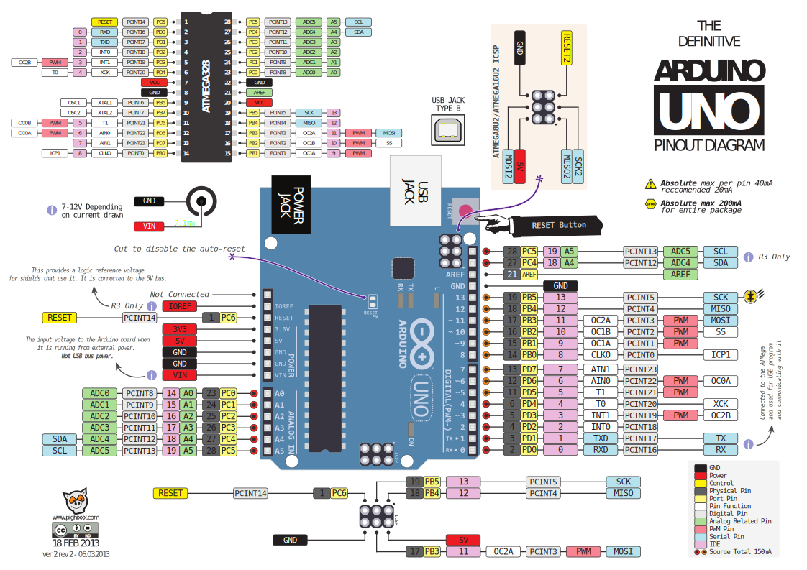
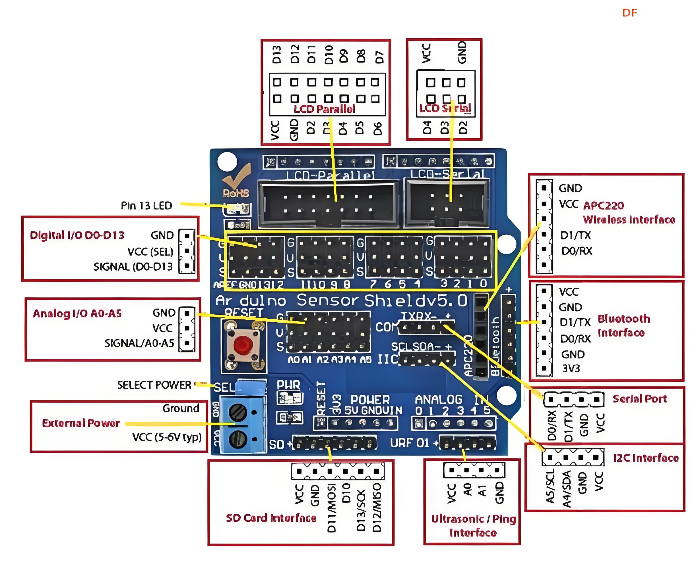
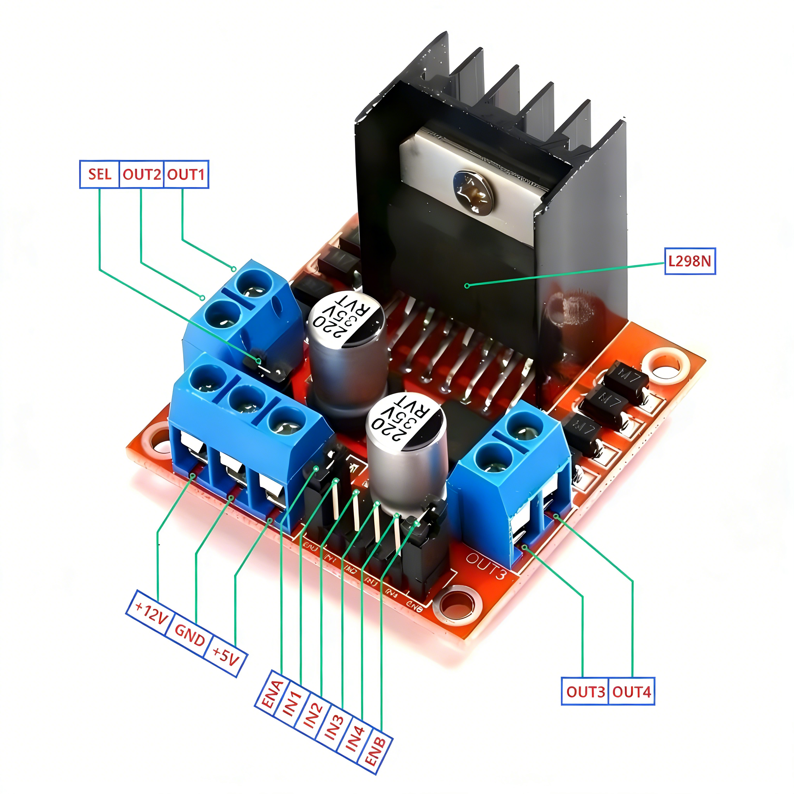
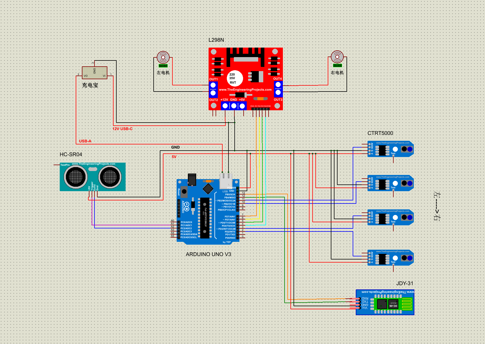
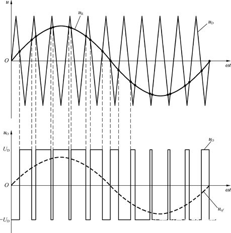
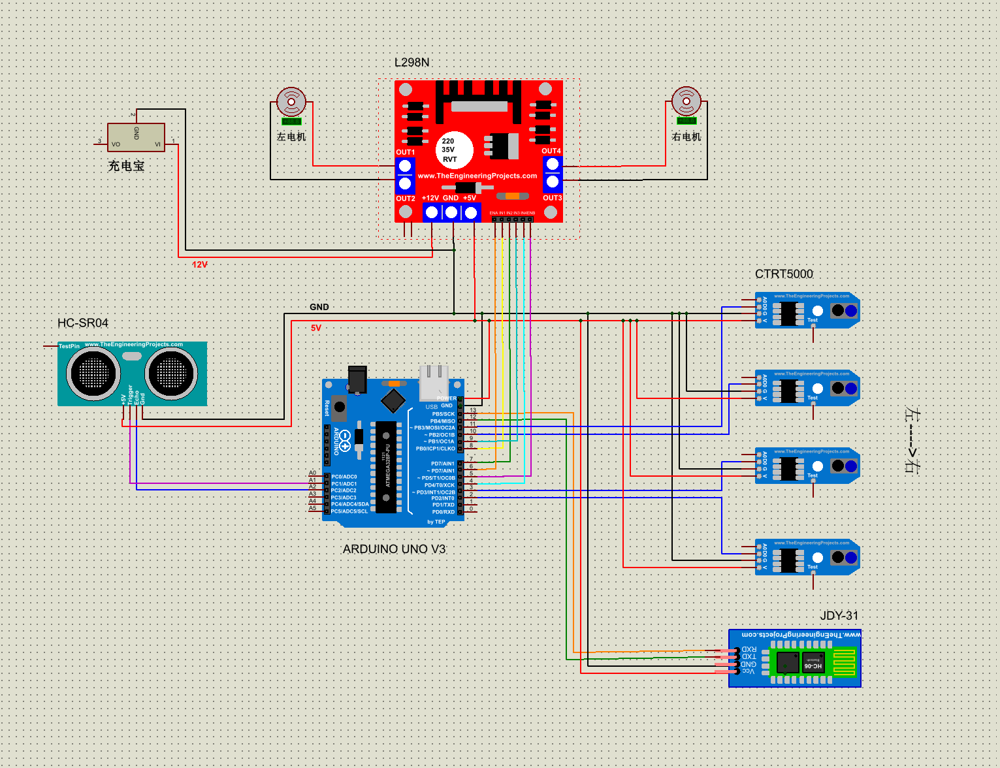

<h1 align="center">循迹小车项目说明</h1>

<span style="color:  #87CEFA ">丙午正月，研习旧艺，裨补缺漏，以便来者。</span>

## 总览


|   元器件   |    型号     |
| :--------: | :---------: |
|   开发板   | Arduini Uno |
|   拓展版   |  Uno R3 v5  |
|   驱动板   |    L298N    |
|  蓝牙模块  |   JDY-31    |
| 超声波模块 |   HC-SR04   |
|  红外模块  |  TCRT5000   |

## 一、硬件

### 1.1 开发板



#### 1.1.1 电源引脚

Arduino Uno 开发板理论供电范围为 5–20V，厂家建议工作电压为 **7–12V**。
电压高于 12V 易导致稳压芯片过热，低于 7V 则可能出现供电不足、系统不稳定。

可通过以下三种方式供电：
- 直流电源插孔
- VIN 引脚
- USB 接口
  - 5V 稳压输出，最大输入电流约 500mA。
  - 使用充电宝供电最为便捷，<span style="color:#FF6347 ">充电宝输出功率建议不低于15W。</span>

---

#### 1.1.2 数字引脚

即D0–D13。数字引脚可通过程序配置为**输入**或**输出**，只识别高低两种电平：
- 输出模式：高电平为 5V（记为 1），低电平为 0V（记为 0）。
- 输入模式：由外部设备提供电压，芯片根据阈值判断为 0 或 1：
  - 低于 0.8V → 判定为 0
  - 高于 2.0V → 判定为 1
  - 介于两者之间 → 结果不确定

以下引脚具有特殊功能，使用时需格外注意：

- **D0 / D1**
  用于开发板与电脑串口通信，与 USB 功能冲突。
  若被占用，将无法上传程序、无法使用串口监视器打印调试信息。
  **实际项目中尽量不要使用！**

- **D2 / D3**
  支持**外部中断**[^1]，可用于电平快速触发响应。

- **D3、5、6、9、10、11**
  带 `~` 标识的 **PWM 引脚**[^2]，可通过调节占空比模拟 0–5V 之间的电压，共 256 级。
  常用于 LED 调光、电机调速、舵机角度控制。

- **D13**
  片载 LED 指示灯专用引脚，驱动能力弱，**不可带动大负载外设**。

除特殊功能外，这些引脚均可作为普通数字引脚使用。

---

#### 1.1.3 模拟引脚

即A0–A5。模拟引脚主要用于读取连续变化的电压信号，也可作为普通数字引脚使用：

- 作为数字引脚：编号对应 D14–D19，**不支持 PWM**。
- 作为模拟输入：分辨率为 10 位，可将 0–5V 电压分为 1024 个等级。
  例如红外传感器：
  - 接数字引脚 → 只能判断“有/无黑线”
  - 接模拟引脚 → 可读取距离黑线的远近

在常规循迹小车中使用较少。

---

#### 1.1.4 通信引脚

支持串口、I2C、SPI 等通信协议，引脚与数字/模拟引脚复用。

---

### 1.2 拓展板



拓展板引脚与 Arduino 开发板引脚一一对应映射，方便接线与扩展。

**外部电源输入区（External Power）**
USB 供电最大电流约 500mA，若使用舵机等大电流器件，需从此处独立供电，避免电流不足。
不建议新手随意使用，供电风险较高。

**复位按钮（RESET）**
硬件复位，重启程序运行。
调试时可快速重启，无需反复插拔 USB，适合循环测试。

**数字输入输出区（Digital I/O D0–D13）**
位于拓展板中部，共 14 组 3Pin 接口，每组定义：
`GND(G) - VCC(V) - SIGNAL(S)`
所有 G 端共地。
可接数字传感器、按键、LED、蜂鸣器、继电器等。

**模拟输入输出区（Analog I/O A0–A5）**
用于连接模拟量传感器：
光敏电阻、LM35 温度传感器、土壤湿度传感器、电位器、摇杆模块等。

**蓝牙接口区（Bluetooth Interface）**
默认使用 D0/D1 串口，与下载、调试冲突，**一般不推荐使用**。

**超声波接口区（Ultrasonic Interface）**
专用 HC-SR04 接口，使用 A0/A1 引脚，简化接线，支持测距。

---

### 1.3 驱动板



- **IN1–IN4**：逻辑控制输入，接收单片机信号。
- **ENA / ENB**：使能引脚，控制对应 H 桥是否工作。
  - 高电平 → 电机允许工作
  - 低电平 → 电机停止
  拔掉跳线帽后可接入 PWM 信号，实现电机调速。
- **OUT1–OUT4**：功率输出端，直接连接电机两端。

L298N 内置两路独立 H 桥，每路可控制一个电机的转向与启停：

| IN1/IN3 | IN2/IN4 | 电机状态 |
|--------|---------|----------|
| 0      | 0       | 停止/制动 |
| 0      | 1       | 反转     |
| 1      | 0       | 正转     |
| 1      | 1       | 停止/制动 |

**电源**
- **+5V**：为板载逻辑电路供电，可由外部或单片机提供。
- **+12V**：为电机驱动供电，根据电机额定电压选择电源。

若不使用 PWM，仅用充电宝给 GND 和 +12V 供电，不接 +5V 也可正常工作。

---

### 1.4 其他模块

#### 1.4.1 蓝牙模块

代码声明：

```
SoftwareSerial bluetooth(RX, TX);
```

模块引脚：VCC、GND、RXD、TXD
注意：**接收 ↔ 发射 交叉接线**
- 单片机 RX → 模块 TXD
- 单片机 TX → 模块 RXD

#### 1.4.2 超声波模块

代码声明：
```cpp
const int TRIG_PIN = AX;
const int ECHO_PIN = AY;
```

模块引脚：VCC、GND、TRIG、ECHO
按程序定义直接接线即可。

#### 1.4.3 红外模块

代码声明：
```cpp
const int IR_LEFTMOST = DX/AX;
```

模块引脚：VCC、GND、D0、A0

一般使用数字引脚，判断有无黑线。需要距离信息时使用模拟引脚。

---

## 二、代码

### 主要功能

- 蓝牙遥控
- 手动 / 自动模式切换
- 蓝牙心跳保活
- 自动循迹
- 超声波避障

---

### 2.1 蓝牙遥控与模式切换

接收单字符指令，大小写不敏感，支持命令：
- F 前进 / B 后退 / L 原地左转 / R 原地右转
- A 平滑左转 / D 平滑右转 / S 停止
- **X** 切换 自动循线 ↔ 手动遥控
  收到方向指令自动切手动；收到 X 切换模式并停车。

```cpp
if (bluetooth.available() > 0) {
    char cmd = bluetooth.read();
    ...
    char upperCmd = toupper(cmd);
    
    if (upperCmd == 'X') {
        autoMode = !autoMode;
        stopCar();
        bluetooth.println(autoMode ? "自动模式" : "手动模式");
    } 
    else {
        btCommand = upperCmd;
        autoMode = false;
        bluetooth.print("执行: ");
        bluetooth.println(upperCmd);
    }
}
```

---

### 2.2 蓝牙心跳

使用软件串口模拟蓝牙通信：
```cpp
SoftwareSerial bluetooth(12, 13);  // RX=12, TX=13
bluetooth.begin(9600);
```

**心跳功能**：每 1.5 秒发送一个 `.`，用于：
- 维持蓝牙连接不断开
- 直观显示连接状态

```cpp
if (millis() - lastHeartbeat >= HEARTBEAT_INTERVAL) {
    bluetooth.print(".");
    lastHeartbeat = millis();
}
```

---

### 2.3 四路红外循线

传感器逻辑
- 检测到**黑线**：输出 0（低电平）
- 检测到**白底**：输出 1（高电平）

采用分级纠偏策略
- 中间两个都在白线上 → 直行
- 左中压线 → 轻微右转修正
- 右中压线 → 轻微左转修正
- 最左压线 → 大幅度右转
- 最右压线 → 大幅度左转
- 均未检测到 → 停车

```cpp
void lineTracking() {
    int s1 = digitalRead(IR_LEFTMOST);
    int s2 = digitalRead(IR_LEFT);
    int s3 = digitalRead(IR_RIGHT);
    int s4 = digitalRead(IR_RIGHTMOST);
    
    if (s2 == 1 && s3 == 1) {
        forward();           // 居中
    }
    else if (s2 == 0 && s3 == 1) {
        turnRightSmooth();   // 轻微偏左 → 右修正
    }
    else if (s2 == 1 && s3 == 0) {
        turnLeftSmooth();    // 轻微偏右 → 左修正
    }
    else if (s1 == 0) {
        spinRight();         // 严重偏左 → 强烈右转
    }
    else if (s4 == 0) {
        spinLeft();          // 严重偏右 → 强烈左转
    }
    else {
        stopCar();
    }
}
```

---

### 2.4 非阻塞式超声避障

设定避障距离：小于 16cm 进入避障流程：
1. 停止
2. 后退 0.5 秒
3. 原地右转 0.6 秒
4. 前进 1 秒
5. 恢复循线

使用 `millis()` 实现**非阻塞[^3]控制**，不影响传感器与蓝牙实时响应。

```cpp
void avoidObstacle() {
    unsigned long now = millis();
    switch (avoidPhase) {
        case 0: stopCar(); avoidStartTime = now; avoidPhase = 1; break;
        case 1: if (now - avoidStartTime >= 500) { back(); avoidStartTime = now; avoidPhase = 2; } break;
        case 2: if (now - avoidStartTime >= 600) { spinRight(); avoidStartTime = now; avoidPhase = 3; } break;
        case 3: if (now - avoidStartTime >= 1000) { forward(); avoidStartTime = now; avoidPhase = 4; } break;
        case 4: if (now - avoidStartTime >= 800) { avoidPhase = 0; } break;
    }
}
```

主循环中每 80 ms 检查一次距离，决定执行避障还是巡线：

```cpp
long dist = getDistance();
if (dist < AVOID_DISTANCE && dist > 0 && dist != 999) {
    avoidObstacle();
}
else {
    if (avoidPhase != 0) avoidPhase = 0;
    lineTracking();
}
```

---

### 2.5 电机控制接口

所有运动统一通过 `setMotor(左轮, 右轮)` 控制：
- 1 = 前进
- -1 = 后退
- 0 = 停止

```cpp
void setMotor(int dirL, int dirR) {
    digitalWrite(IN1, dirL == 1 ? HIGH : LOW);
    digitalWrite(IN2, dirL == -1 ? HIGH : LOW);
    digitalWrite(IN3, dirR == 1 ? HIGH : LOW);
    digitalWrite(IN4, dirR == -1 ? HIGH : LOW);
}
```

在此基础上封装所有动作函数，结构清晰、便于维护。

```cpp
void forward()        { setMotor(1, 1); }
void back()           { setMotor(-1, -1); }
void spinLeft()       { setMotor(-1, 1); }
void spinRight()      { setMotor(1, -1); }
void turnLeftSmooth() { setMotor(0, 1); }
void turnRightSmooth(){ setMotor(1, 0); }
```

---

## 三、连线



**注意：拓展板与驱动板必须共地（GND 相连）。**

---

## 四、脉冲宽度调制（PWM）

### 4.1 原理

PWM是用数字信号控制模拟电路的常用技术。
基本原理是通过改变一系列固定频率脉冲（方波/三角波）的宽度，从而调节这些脉冲的占空比（高电平时间与整个周期时间的比例），以此来模拟连续的模拟信号（正弦波）。

在本项目中主要用于**电机无级调速**[^4]。



---

### 4.2 代码详解

+ <span style="font-size: 20px">**PWM 引脚控制电机速度**</span>

实现 0–255 级连续调速，而不是只有全速或停止，让小车可以慢速巡线、柔和转向、快速避障等。

```cpp
const int ENA = 6;             // 左电机 PWM 调速
const int ENB = 5;             // 右电机 PWM 调速

// 在 setMotor 函数中实际输出
analogWrite(ENA, abs(speedL));
analogWrite(ENB, abs(speedR));
```


+ <span style="font-size: 20px">**全局速度级别 1–10 可通过蓝牙调节**</span>

发送数字 0–9 即可设置速度等级，整车动作同步变快或变慢。  

```cpp
int speedLevel = 5;            // 默认速度级别 5

// 蓝牙接收处理部分
if (cmd >= '0' && cmd <= '9') {
  speedLevel = (cmd == '0') ? 10 : cmd - '0';
  speedLevel = constrain(speedLevel, 1, 10);
  bluetooth.print("速度级别: ");
  bluetooth.println(speedLevel);
}
```

+ <span style="font-size: 20px">**线性映射计算当前基准速度**</span>

让速度级别从 1（最快 ≈255）到 10（最慢 ≈70）的平滑线性变化。  

```cpp
int getCurrentBaseSpeed() {
  int spd = SPEED_MAX - (SPEED_MAX - SPEED_MIN) * (speedLevel - 1) / 9;
  // SPEED_MAX = 255, SPEED_MIN = 70
  if (spd > 0 && spd < 60) spd = 60;  // 最低保护
  return spd;
}
```


+ <span style="font-size: 20px">**最低速度硬限幅 ≥ 60**</span>

普通直流电机低速启动困难，设置下限避免电机抖动不转。

```cpp
if (spd > 0 && spd < 60) spd = 60;
```


+ <span style="font-size: 20px">**动作速度按比例缩放**</span>

保证任何速度级别下，直行、转弯、自旋的速度比例一致，操控更自然。 

```cpp
int getScaledSpeed(int original) {
  return (original * getCurrentBaseSpeed()) / 150;
}
```
为什么除 150：代码中大多数基准速度（如 BASE_SPEED、SPIN_SPEED）都设为 150，作为缩放中心。


+ <span style="font-size: 20px">**方向与速度分离**</span>

用正负表示方向，绝对值表示速度。

```cpp
digitalWrite(IN1, speedL >= 0 ? HIGH : LOW);
digitalWrite(IN2, speedL >= 0 ? LOW : HIGH);
analogWrite(ENA, abs(speedL));
```


+ <span style="font-size: 20px">**速度值强制约束 -255 ~ 255+ **</span>

防止代码 bug 或异常数据导致 PWM 值超出范围，保护硬件。  

```cpp
speedL = constrain(speedL, -255, 255);
speedR = constrain(speedR, -255, 255);
```


+ <span style="font-size: 20px">**不同动作使用独立基准速度**</span>

便于分别调试直行、转向、旋转的速度手感。

```cpp
const int BASE_SPEED     = 150;  // 前进基准
const int SPIN_SPEED     = 150;  // 原地旋转基准
const int FAST_TURN      = 125;  // 快速平滑转向外轮
const int SLOW_TURN      = 70;   // 慢速平滑转弯内轮
```


+ <span style="font-size: 20px">**所有电机控制统一通过 setMotor 函数**</span>

集中管理 PWM 输出和方向控制，便于维护、调试和未来扩展。

```cpp
void setMotor(int speedL, int speedR) {
  speedL = constrain(speedL, -255, 255);
  speedR = constrain(speedR, -255, 255);
  
  // 左电机
  digitalWrite(IN1, speedL >= 0 ? HIGH : LOW);
  digitalWrite(IN2, speedL >= 0 ? LOW : HIGH);
  analogWrite(ENA, abs(speedL));
  
  // 右电机
  digitalWrite(IN3, speedR >= 0 ? HIGH : LOW);
  digitalWrite(IN4, speedR >= 0 ? LOW : HIGH);
  analogWrite(ENB, abs(speedR));
}
```

---

### 4.3 连线



**PWM 调速**

拔掉 ENA、ENB 上的跳线帽，将**每通道下方的使能引脚**接入 Arduino PWM 引脚。

- ENA → 控制左侧电机
- ENB → 控制右侧电机

电机转速与 PWM 占空比成正比，占空比越大，转速越快。

**电源配置**

- 充电宝 USB 分线连接驱动板 GND / +12V
- 驱动板 GND / +5V 分别连接拓展板 GND / VCC

---

## 注释

[^1]:中断CPU的工作，优先处理引脚的信号变化，再返回原工作。
[^2]: 详见【四、脉冲宽度调制】。
[^3]: 执行避障逻辑时，不阻塞传感器读取、蓝牙接收等其他功能。
[^4]:转速可以连续、平滑地任意调节。


> 遥控软件推荐**Arduino Bluetooth Control**
>
> <span style="color:  #87CEFA ">当前方案循迹和PWM功能稳定性一般，待改进……</span>

